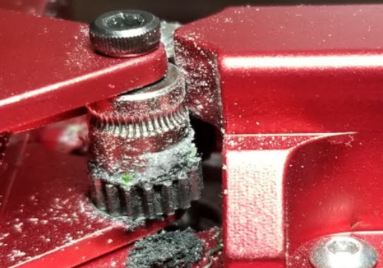

# The Ender of an era.
In this post I will talk a little bit about my year and a half long journey in 3D printing in general, and with my Ender 3 Pro in particular. The focus will be on which upgrades I have tried, if they are worthwhile or not and what my current 3D printer situation looks like.

## My background
I am a software engineer since 14 years who has a keen interest in electronics too. I had played around with several Arduino and Raspberry Pi projects before I bought a printer. I also have comfortable soldering and designing basic circuits.

## Setting up your printer
This is a crucial step, however it is a step that is thoroughly covered in several build videos online. Tomb of 3D Printing Horrors has an amazing video on assembly that you should follow to get the frame as square as possible. Here's a couple of things that I have learned to always check for the Ender 3.

### Making sure that the Z axis extrusions are square.
One of the easiest ways to do this is to tighten the screws down and back them off a bit. Then use a ruler to measure the distance between the extrusions at the bottom and at the top. This value should be 250mm. Now you can tighten/loosen the screws underneath to tilt the extrusions inwards/outwards until the measurements are correct. Once this step is completed you could be able to place the top bar on and screw the screws into the threads with your fingers easily.

### Making sure that the X gantry is the correct width
So, the X gantry extrusion is fastened into the 2 plates that are holding the X axis motor and rollers, but these screws have a little bit of play. You should never loosen these screws while your X axis belt is tensioned, this will push the plates towards the middle and it will mess up your life, because when you put the X gantry on the machine it will squeeze the Z axis extrusions together. Loosen the belt, loosen the screws and then tighten them.

### Making sure the rollers aren't too tight or too lose
The build videos cover this well, but it is easily and quickly forgotten what the proper pressure of the wheels should be. The correct answer here is that they should only be tight enough so that you can still rotate the opposite wheels (not the ones with eccentric nuts) with your fingers.

### Making sure that the Y axis rollers aren't unevenly tightened
Try wobbling the build plate a bit side to side with your fingers. If you can do that, the rollers are set up incorrectly. Same goes if you roll the build plate back and forth and you can feel it bump a little bit.

Loosen the eccentric nuts and tighten them slowly while rotating the opposite wheels with your fingers, trying to feel out the right setting. Once you are done you should not be able to wiggle the build plate side to side and it should be stable when you move it back and forth.

### Making sure that your belts aren't too tight or too lose
If your belts are too tensioned, they will stretch over time and it can result in other problems with your print quality. You can print/buy belt tensioners if your printer doesn't already have them, but for most people they aren't needed, it's just a quality of life thing. You rarely re-tension your belts unless you disassemble the printer to make an upgrade or something else. It's also good to learn how to do this manually first. The belts should be tight enough so that they properly grip the pulleys with teeth on them and dont slip when moving back and forth. When printing a calibration cube you can see if you have layer shifts or if the layers arent put exactly on top of one another. If your belts are too loose the layers will shift.

### The stock extruder, hotend, bowden and replacing the PTFE tube
I still can't believe that the Ender comes with a PTFE lined hotend when the all metal ones are pretty much the same price. Anyways, here you can run into several issues because the PTFE couplers that come with the Ender is usually very poor and should be replaced. They will cause the PTFE tube (bowden) to slide back and forth while the extruder is retracting filament. You can see this by using a permanent marker to put a dot on the PTFE tube right next to the couplers, this dot should not be moving if the coupler grabs the tube properly.

Another common issue with the Ender 3 hotend is that there is a gap between the bowden tube and the nozzle itself, either because the bowden tube hasn't been inserted properly, the nozzle hasn't been tightened or that the bowden tube has not been cut straight, leaving a small space between it and the nozzle which will cause issues. All these problems will manifest themselves as stringing and/or the hotend leaking. The bowden tube gap can also cause a clog in the hotend, jamming it in the process.

There are several videos covering this, how to change PTFE couplers and how to re-seat the bowden tube after cutting it straight. Usually this is not something you have to do if it is a new printer, but this is something you should keep in mind every time you do some work in this area, making sure everything is put back in place properly.

### Preventing Z binding/banding
Z binding manifests itself as visible lines in your print at certain heights. This can be difficult to figure out at first because it can manifest itself similarly to a slightly loose belt that caused a layer shift or under/over extrusion to the untrained eye. Google images for "z binding" or "z banding" and you will see some examples.

This can occur if your leadscrew is bent, not lubricated enough, or if the trapezoidal nut is tightened at the wrong angle or position, forcing the leadscrew into a position where it cannot rotate cleanly, hence causing it to bind.

Follow the guides on how to seat the Z motor, some people use the manual underneath the motor when screwing it in to keep it straight, others use a steel ruler, there's also printable motor supports you can use for this. This helps to keep the base straight, giving the leadscrew a fairer chance to point straight up.

When fastening the coupler, make sure that it does not touch the motor housing. Different couplers need different space between itself and the motor but the stock one should only need a millimeter or so.

The leadscrew is already greased, but the grease used is quite poor. If you can, wipe the grease off and replace it with PTFE grease or White Lithium Grease.

Support the X gantry with a filament box or something, back off the screws of the trapezoidal nut so that it is very loose - now put the leadscrew through the nut, into the coupler and tighten only the coupler, leaving the trapezoidal nut loose still. Carefully remove the X gantry support and hold your hand underneath to make sure that you properly tightened the Z coupler, preventing the gantry from falling.

Use your hand to spin the coupler, raising the X gantry to the top of the machine. Tighten the trapezoidal nut all the way, then back both screws 2 full turns. Now spin the Z coupler the opposite direction, moving the X gantry all the way down to the bed. After that you can tighten the screws on the trapezoidal nut but there is no need for them to be super tight, when screwing them in and you start encountering resistance, stop.

Now, try moving the X gantry up and down the Z axis, there should be no binding and no tight spots. If there is, loosen the screws on the trapezoidal nuts again and keep moving the Z axis up and down until it feels smooth.

### Making sure your X gantry is level
Place the X gantry about halfway up from the bed on the Z axis. Now use a ruler and measure the distance between the X gantry extrusion and the top bar on each side. They should be equal distances. If they aren't there's a great video showing how to fix this [here](https://www.youtube.com/watch?v=4bFYH0X3qjk).

This can also be fixed by having dual Z leadscrews or a belted Z axis. (see upgrades section)

### Making sure your bed is lev

## Troubleshooting

### BLTouch probe not deploying/stowing properly after using it for a few months
It is most likely not broken and I cannot believe I dont see more people talking about this. Eventually this will happen to your probe, it is because it is deployed and stowed using a magnet. This magnet will lose strength over time and you have to re-magnetize it. Just remove the BLTouch and unscrew the middle grub screw on top, removing the probe itself. Now place a magnet near the magnet on the probe and put it back into the BLTouch body, then screw the grub screw back in. Your probe should be working properly again.

## Maintenance check list
- Make sure rollers aren't too tight / lose
- Make sure rollers don't have any flat spots or are worn out, if they are - replace them.
- Make sure lead screw is greased and moves smoothly. Add a bit of grease and move the Z axis up and down a few times to spread the grease.
- Make sure belts are tight enough
- Make sure that the hotend isn't leaking
## Upgrades
I've been able to try most upgrades that people usually try. Below, I will list them and tell you if they are worth it or not, and which I would say are essential and/or recommended.

Starting with the bad, progressing to the good.

### UPGRADES TO AVOID
#### Lead screw stabilizers
These can actually cause the leadscrew to bind. It looks cool and sounds like a good upgrade but it requires the leadscrew to be 100% straight and have a perfect alignment with the motor, frame and trapezoidal nut. There is absolutely no need to install these.

#### Red aluminium dual gear extruder
If you have seen this one, you might be surprised to find that I list this one here. But this part has a crucial design flaw. Once you install it, it starts wearing out rapidly because there is no washer between the gear that isn't attached on the motor and the aluminium underneath, so it will over time grind the aluminium down, leaving dust all over the place and eventually just affecting your print quality.

### UPGRADES THAT ARE NOT NEEDED, BUT ARE NICE
#### X axis belt tensioner (printed or metal one)
This is a good upgrade but it can also make it tricky to align the belt properly, be mindful to make sure that the belt isn't scraping against the aluminum extrusion when it moves. 

#### Y axis belt tensioner (printed or metal one)
This is less needed than the X axis since you are less likely to remove the Y belt or release the tension. You tension this very rarely anyway. 

#### Creality Silent Mainboard
I would not buy this again, simply because the SKR is better and cheaper (see good upgrades)

### UPGRADES THAT ARE GOOD

#### Glass bed
You can buy one from Creality directly, or buy a piece of glass / mirror and cut it yourself. The one from Creality has a special surface on it making parts pop off easier. Remember that you cannot print PETG straight on glass, you have to use glue stick or some other release agent to avoid destroying the glass surface.

#### Spring steel sheet
This is an upgrade to the flexible build plate that comes with the Ender 3 Pro. If you have the regular Ender 3 I would suggest getting this one right away. They usually come with a PEI sheet on it, but if you manage to destroy it or it wears out you can just peel it off and replace it with a new PEI sheet. PEI is an amazing material to print on, one of the best upgrades for quality of life. Pick between smooth and textured PEI for different surfaces beneath your prints! :)

#### Aluminium extruder
You can find these on Amazon or AliExpress for kind of cheap. They are just an aluminium version of the stock extruder, making it a worthwhile upgrade. (However, not the best upgrade)

#### EZR Struder
This is a great extruder for sure, I would put it above the aluminium extruder though, but it's more expensive.

#### Raspberry Pi (Octoprint / Klipper)
Control your printer remotely, upload GCODE via WiFi and start/stop/monitor prints from your phone/pc. This is a fantastic upgrade. Installing Klipper instead of Octoprint is for advanced users, but unlocks higher print speeds and other great features that Marlin and Octoprint does not have.

#### 5015 blower fans
I use dual 12v Sunon blower fans and with Hydra Fan Duct (see ultimate upgrades section) I can bridge across my entire build plate.
[TODO: Add wiring scheme image here]

#### Hero Me / Bullseye fan duct
This is a good fan duct loved by many users. Easy to print and easy to install. Use PETG for this, not PLA. (See ultimate upgrades section for an even better duct)

### UPGRADES THAT ARE ESSENTIAL
These are upgrades that you should go for if you get the chance.

#### Yellow bed springs / silicone bed spacers
The stock springs are pretty poor, causing you to have to re-level your bed all the time. These are stiffer and makes sure that your bed stays level for longer. This is an essential upgrade for any Ender 3 machine and probably one of the most common ones.

The silicone bed spacers just makes your bed stationary, it will always have the same level but you instead have to make sure that the gantry is aligned relative to the silicone bed spacers. This is an advanced upgrade and you should only do it if you know what you are doing.

#### Capricorn PTFE tube
This is an amazing upgrade for any machine that uses PTFE tubing. But it's even more valuable if you are using bowden instead of direct drive since the inner diameter is closer to that of the filament, making the filament flex much less in the tube, allowing for better print quality.

#### PTFE couplers
You can buy high quality PTFE couplers on Amazon and AliExpress for both the extruder and the hotend. You are 100% going to have to replace the stock couplers with these eventually, might aswell do it sooner rather than later. These are great to have as spares too, since they wear out.

#### SKR Mini E3 v2.0 / SKR 1.4
These are fantastic mainboards. SKR 1.4 doesn't come with drivers and is a more advanced upgrade. The SKR Mini E3 is a drop-in replacement for the stock mainboard and comes with better drivers (TMC2209) than the Creality Silent Mainboard (TMC2208). The reason I think this mainboard is essential is that is has both silent drivers, but also a 32bit chip and a bootloader, making upgrading firmware super easy and you have a lot of space to enable all the features you want, no compromises.

#### Linear Advance (Marlin) / Pressure Advance (Klipper)
This is by far the biggest jump in print quality you will see. And it's only a firmware change and then calibration on your part. But while it does work for bowden, it is more recommended changing to direct drive to get the full benefits.

#### BLTouch

### THE ULTIMATE UPGRADES (My current machine)

#### Hydra Fan Duct
This is an amazing and beautifully designed fan duct system. Supports dual 5015 blower fans as well and has a lot of remixes for modifications. Comes with options for 90 degree, 35 degree and 25 degree  fan ducts.

#### Direct Drive conversion with a pancake stepper motor
There's no need to use the heavy, stock extruder motor for this.

Recommended spares:
- Wheels
- PTFE couplers
- PTFE tube

Upgrades:
- PTFE couplers
- Dual Z leadscrew kit
- TFT35 E3 LCD

Avoid upgrades
